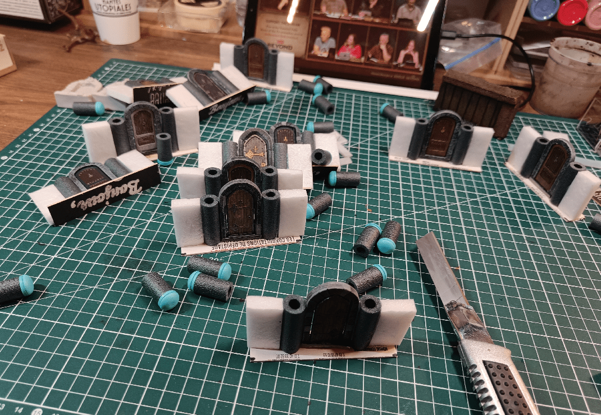
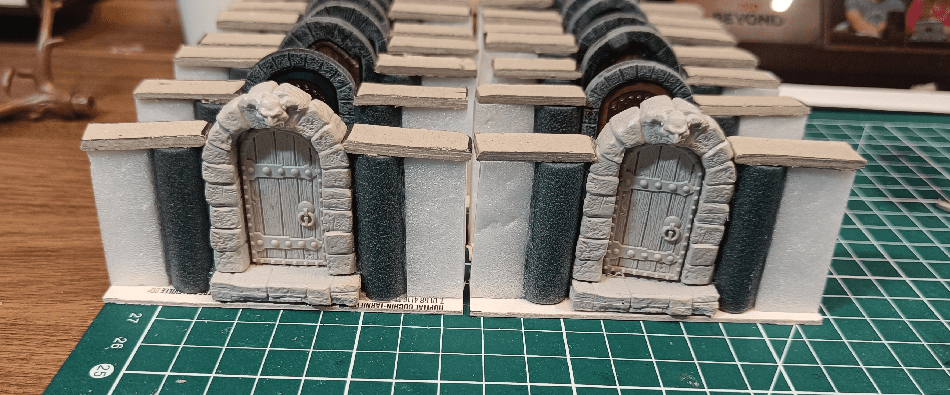
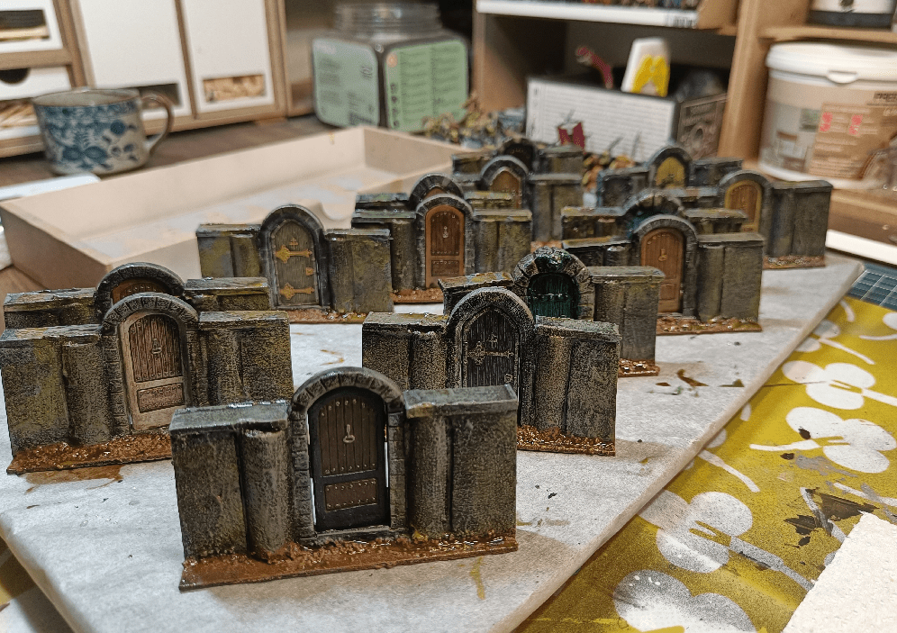

In addition to the walls I previously made, I also needed some with doors. I had tried my hand at some hand craft doors in the past, but it didn't open and close very well.

This time I decided to incorporate the actual doors included in the base game.

I started by cutting the ledge on each of them (yes, I had them already painted).

I glued some NERF bullets on each side, and added a heavy nail at the bottom for weight.

I then glued it at the center of the cardboard, and added some more foam on each side.

Then cut the excess NERF to have it flush with the wall section.

Added some heavy cardstock on top.

For some doors, I used the Wizkids door miniature. Those I will use for the colored doors, that have specific meaning in the scenarios.

Adding some color and basing until the final version.