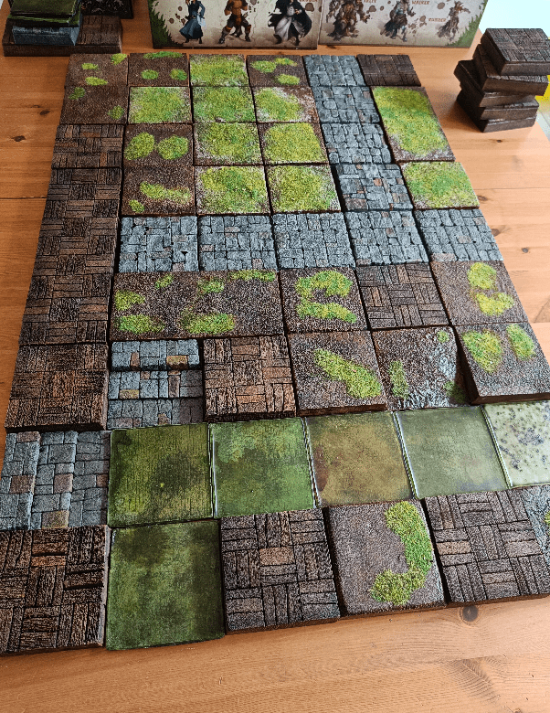
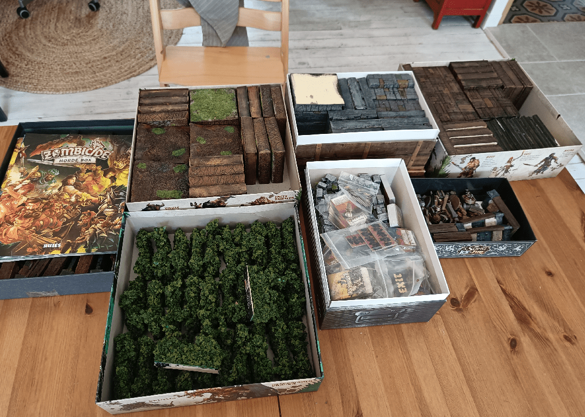

Now that I have all pieces of terrain ready for a game of Zombicide, let's see how it looks like in practice.

First, laying down the base tiles for the first scenario.

Then, adding walls and hedges.

I tried a few other arrangements for other scenarios. Seem to be working ok!

And I can re-use the game boxes to store the 3D pieces.

