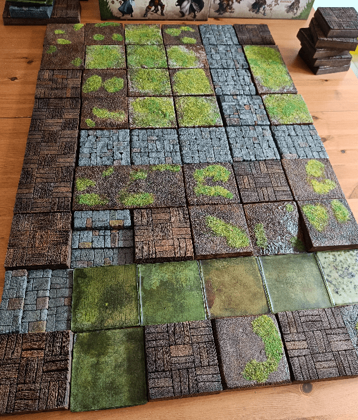
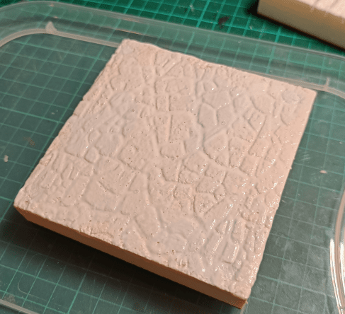
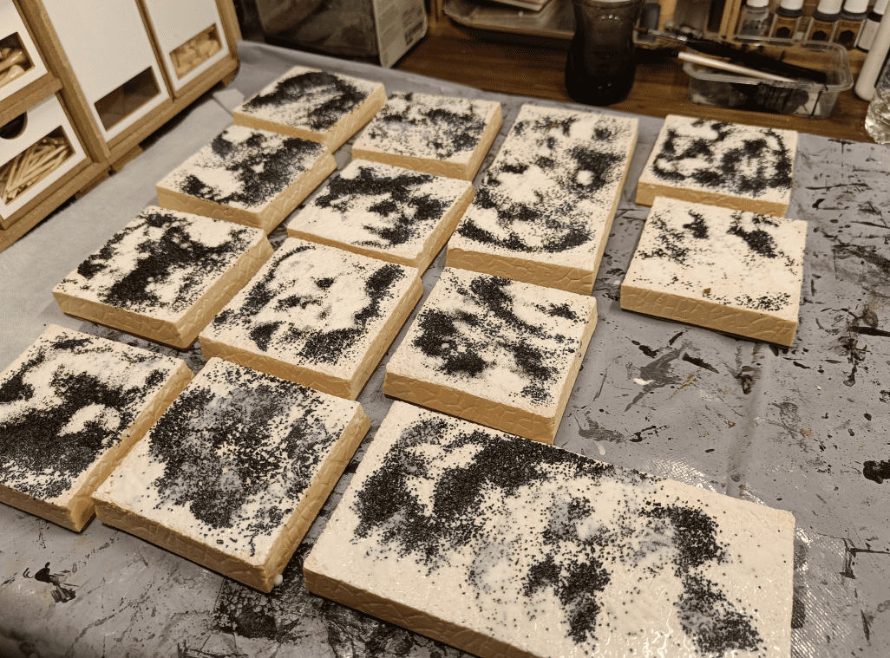
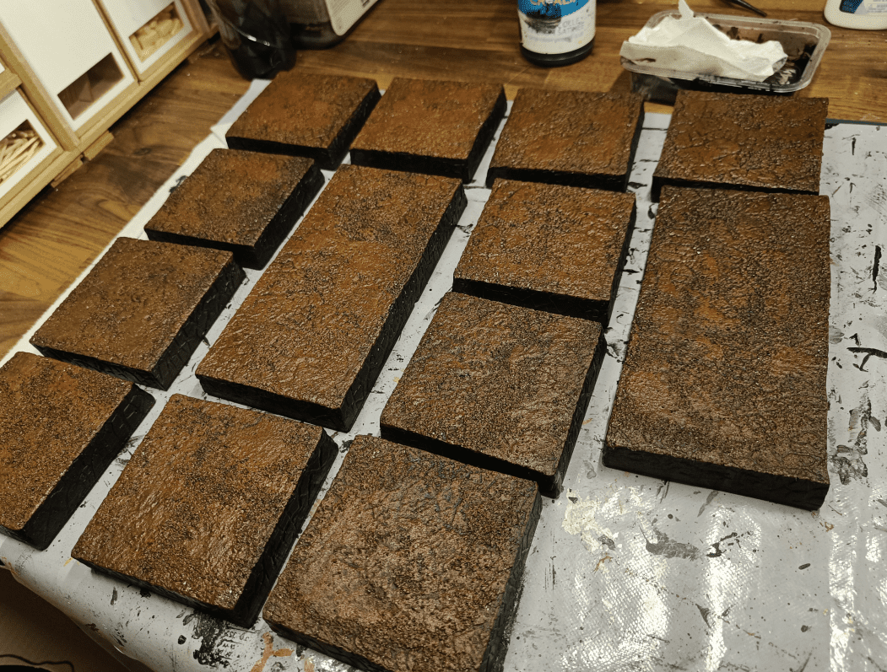
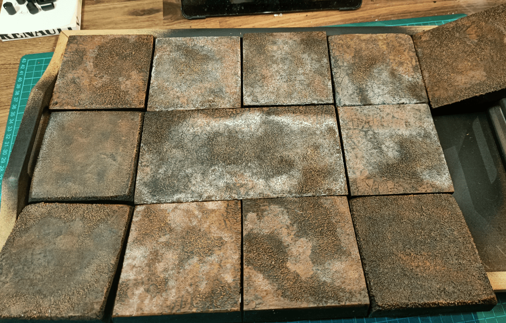
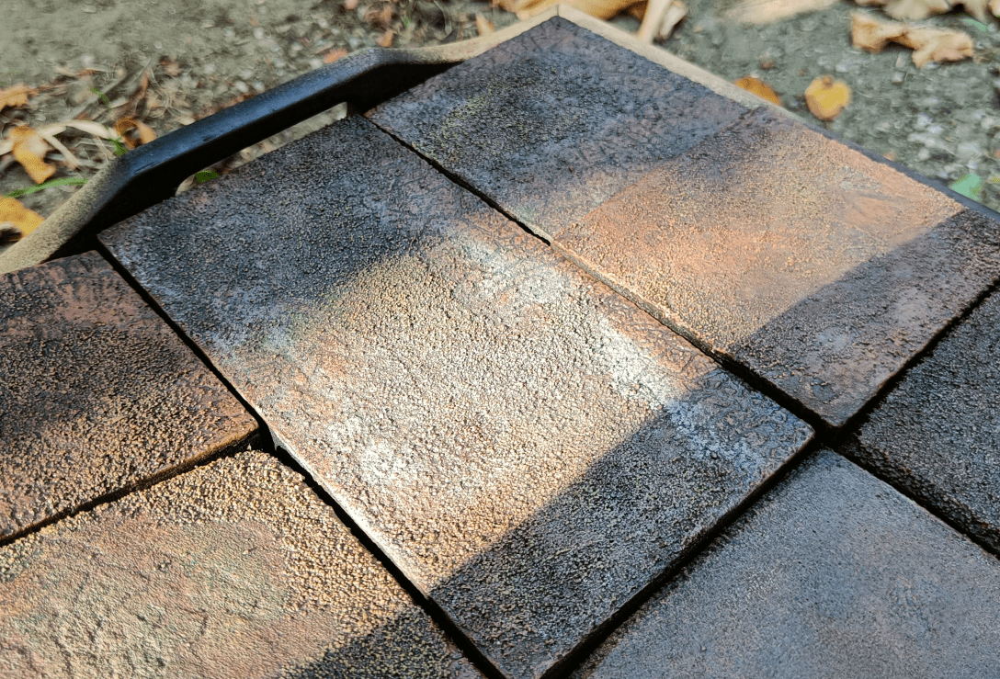
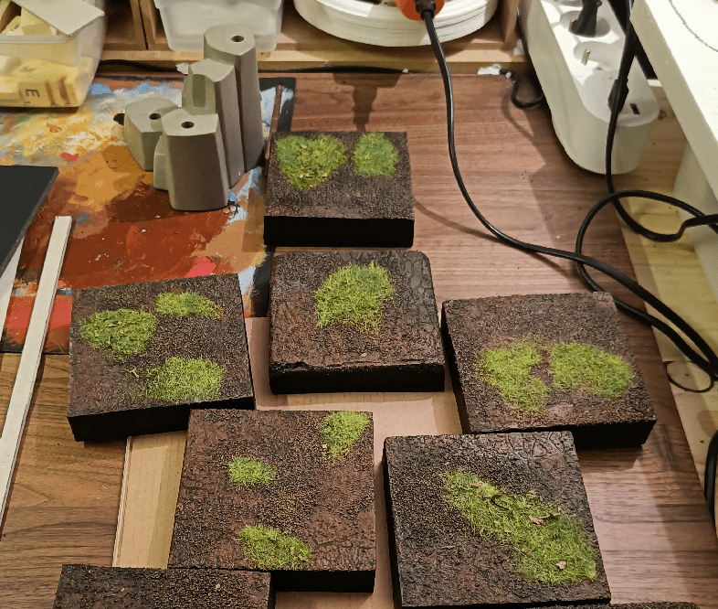

I have started a large project of recreating 3D versions of the Zombicide: Green Horde board. I did a first version with MDF boards for each large tile, but this time I went with something more modulable and that hopefully took less storage: individual squares.

Each Zombicide tile is made of squares, on a 3x3 matrix. Each square can either be the inside of a building, or the outside of it. The outside squares have some variety. You have the deep water tiles, and the high ground tiles. The ground tiles themselves are split into two type, for aesthetic purposes only: stone road and earth gardens. This means that you basically need 4 different types of squares: 

- Water tiles
- Wooden (interior) tiles
- Stone tiles
- Earth tiles

This post is about the making of the earth ones.

I cut glued isolation foam to square pieces of mdf I bought. Then I cut the foam to the size of the board. Each board is about 9cm x 9cm. Gluing first, then cutting allows me to have clean cuts and each square with the same dimensions.

Then I rolled a texture roller on it (really heavily) to imprint some pattern. It won't show much once I'll add the texture and paint, but where it does it adds a nice effect.

I then added added glue and baking soda, to add some rough texture. This was a big mistake, as I'll discover later. Baking soda seems to react to either the sun or the heat, and even painted it turns white again. This ruined my paint job a few times in this build...

I also added fine sand here and there, which is a different texture, bigger grains.

Then basecoated black and with a first drybrush of brown, we can still see the three layers of texture: the roller, the baking soda, and the sand.

I continued with a lighter brush.

And some tan on the sand texture.

This is the ruined effect I was talking about. At some point I had to clean my desk, and I put my (still running) laptop on top of the tiles. Somehow the heat of the laptop reactivated the baking soda and my painted tile turned all white again. 

It looked horrible, like mold.

Thankfully, it was simply turning white, so it was easy to cover it back in brown with diluted paint. It ruined a bit the effect and I had to re-apply the various dry brushes.

And , being extra careful not to put the laptop on top, I put them outside to varnish them. The moment the sun hit them, then turned white again. I still varnished them, thinking that hopefully the varnish would protect the baking soda and prevent it from become white again next time.

Thankfully it worked, and I could turn to finally flocking them, with small patches of greenery. I wondered if I shouldn't have done it in reverse: mostly green with only patches of brown instead of that.

## What I learned

Not using baking soda for texture. Or really mix it heavily with paint first, and then apply it. Since that episode, I avoid baking soda much.

