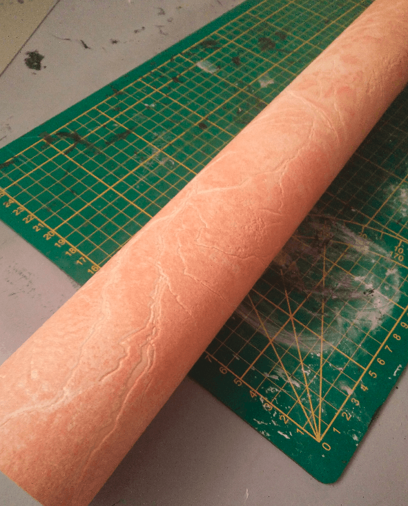
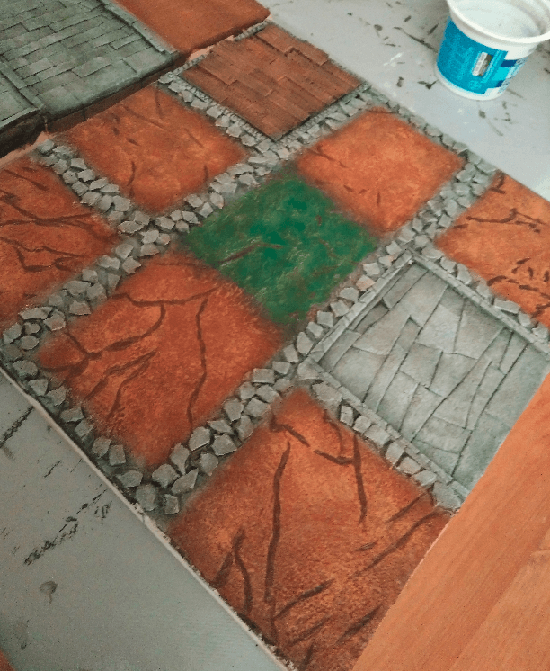
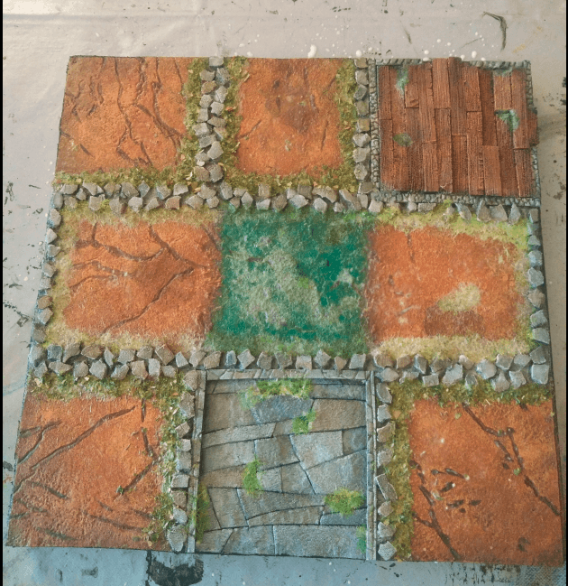
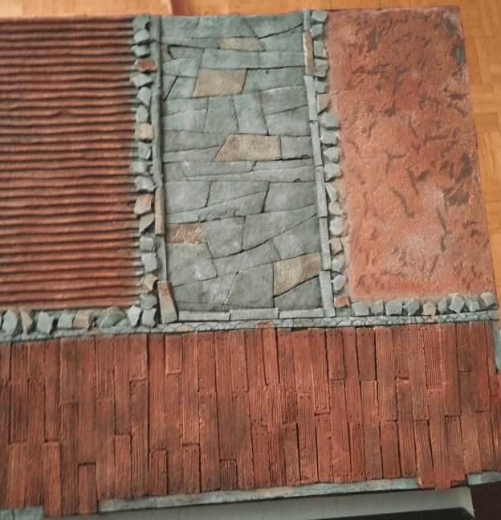
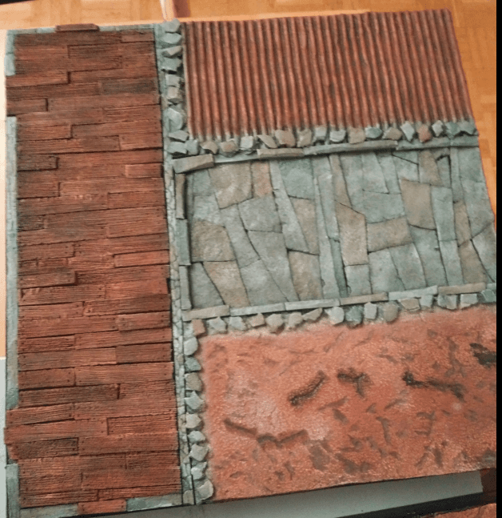
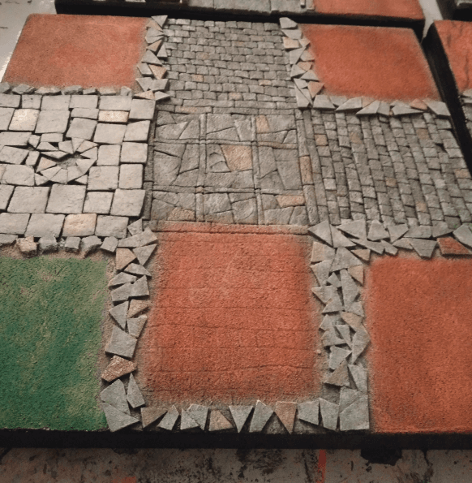
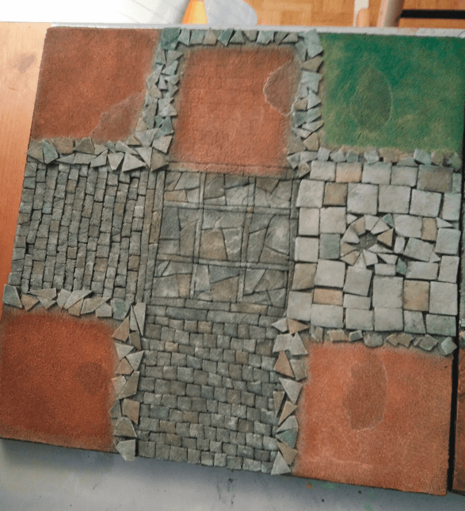
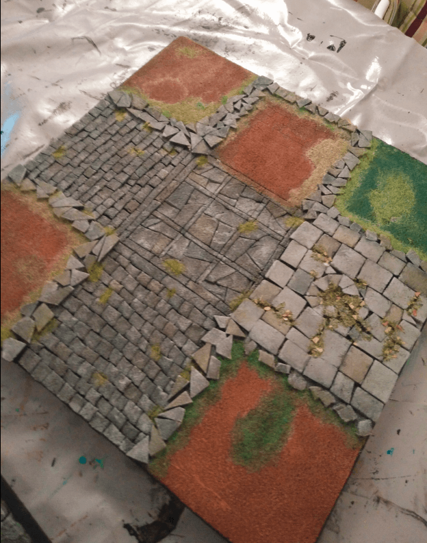
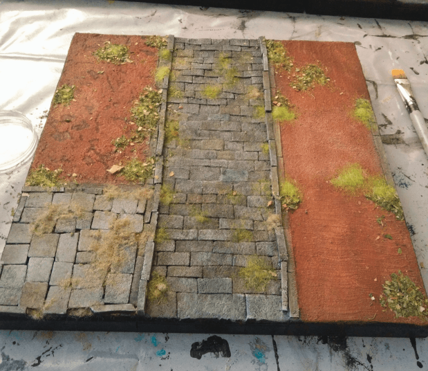
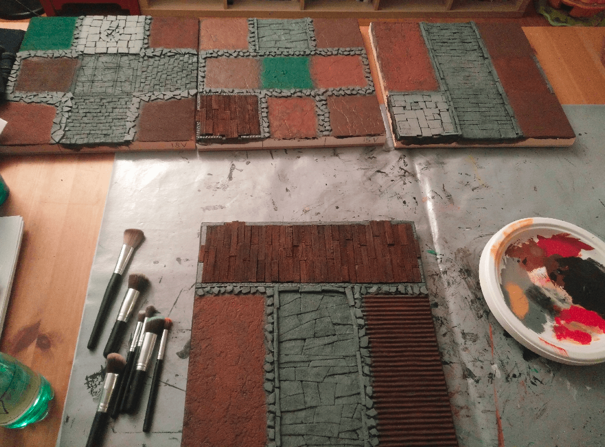

I started working on my second set of tiles of Zombicide Green Horde. I'm building the tiles in the order they are needed in the base scenarios, and not in their "alphabetical order". Note that on the retail game, each tile comes as a hard cardboard tiles, printed on both side. Mine are insulation foam mounted on MDF board, and obviously only playable on one side. So, it takes a lot more space!

I started by cutting the foam to the right size and glue it to the MDF boards. Then, I started texturing the paved roads. I tried several different patterns. Initially it was to break the monotony of the boards, but in hindsight I feel it would have been better to stick to one pattern and actually use it on all boards, to have the boards work well together visually.

Still, trying different patterns gave me the opportunity to try different techniques and see which one render the best results, and also which one require the less amount of work.

### Tile 15V

One the tiles was mostly covered on dried soil, so I used a roll of textured wallpaper I found in a second hand shop as the basis.

This is the thing I bought for ~2€. I can make dozens of tiles with that if the experience proves successful.

 

I then added wood planks made from foam, and lots of little rocks to mark the places where hedges should go. When playing with the official cardboard tiles, hedges are directly printed on it, so you know for sure where your line of sight if blocked. With my custom tiles, I wanted the same kind of information, but I wanted it to be unobtrusive with the actual tile. The compromise I found was to use those small rocks as a boundary.

The rocks are made from a think board of foam that I cut into small pieces with my nails; this gives them an uneven and jagged look.

Everything looks better with black. I was a bit wary at first that my brush strokes would be too visible on top of the textured wallpaper, but it dried pretty flat and the initial texture is very visible underneath.

After the initial covering in colors, I also repainted the cracks in the floor with a darker paint.

Added a wash on top to further bind the effect together.

More details added, especially painting some stones in various shades.

Adding more flocking, mostly to delimit the areas. Maybe I should have used less.

And sealing the flocking with liquid white glue. This looks a complete mess at this stage.

### Tile 12V

For this tile, I tried other recycled materials to texture the various not-road segments. On the left, it's another textured wallpaper I found, and on the right it's simple cardboard to simulate grooves of a field. 

For the main road I carved large stone slabs. They are easier (and faster) to carve than regular straight stones. I know this renders pretty well on dungeon tiles and walls, so I wanted to see how it would turn out for street paving.

The top house floor is made of planks made from foam, of varying thickness, giving this uneven look.

The traditional first coat of black mod podge.

And some base colors added.

I reinforced the patches of dirt on the left with some dark paint.

I'm not sure what happened, but the wallpaper started to turn white in spots. There must have been some kind of reaction with the highly diluted wash I used.

I covered it by re-applying paint on top.

And the flocked preview

Now fixing the flocking with highly diluted white glue.

### Tile 18V

For this tile, I applied the same logic of marking the hedges with small rocks. I covered the ground of the earthy squares with a mix of water, baking soda and white glue. This gave them a rugged look but I think I should have used more baking soda, or added some sand or pebble to make it look like even more like dirt.

I made a mix of green and brown for the various tiles. Drybrushing the rocks also had the nice side effect of doing a smooth transition to the ground.

I painted some stones in various shades using highly diluted paint.

The highly diluted paint somehow reacted with my previous layers here as well, creating those ugly white stains.

Added *a lot* of flocking, but most of it will not stick once the glue is dry, so I'll get it back and use in other projects.

I sprayed very liquid white glue on the flocked part to seal them. Everything looks ugly at that stage, but you have to be brave and wait.

Sealing the flocking made the white stains reappear...

### Tile 13V

On this one I tried another delimiter for the hedges; coffee stirrers. I don't know why but in my mind it could have looked like planks left on the floor. It looked way better in my mind than once glued on the board. I think I'll stay with the rocks idea in the future.

I also applied some baking soda/white glue/water mix on the street itself, to see if it would make it look lire it has seen some use, but the results aren't very satisfying.

The three squares at the bottom are supposed to be separate on the board, so I tried slightly different textures on them; once again to test what would look the best. Left was filling paste, center was nothing but black mod podge and right is some Vallejo texture.

The textured floor took the drybrushing well. The difference between the baking soda and the raw foam is barely noticeable.

A wash to darken everything. I used to mix black paint, water and some flow improver in very specific measurement. Nowadays, I mix black paint and water and that's it.

Colored some stones for variety.

And added flocking, mostly in recesses of the street.

I also added different kind of flocking to each square. I had just received a batch of flocking, so it was a great way to try it out.

Sealing the flocking.

The sealing left some white marks here too...

### Group shots

																																																										

