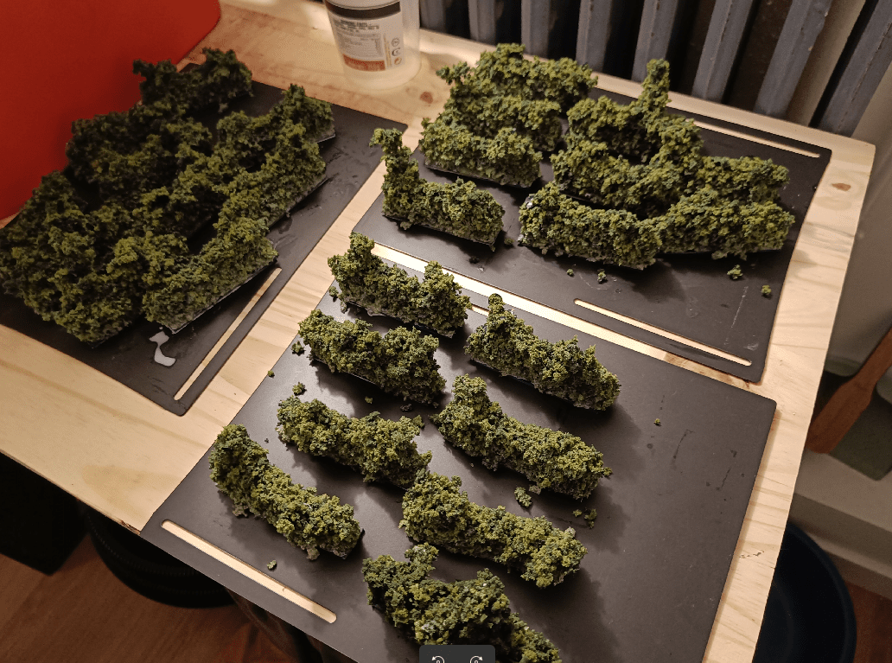

Hedges in Zombicide: Green Horde block line of sight but not movement. I needed a way to represent them in a 3D environment, and I needed LOTS of them.

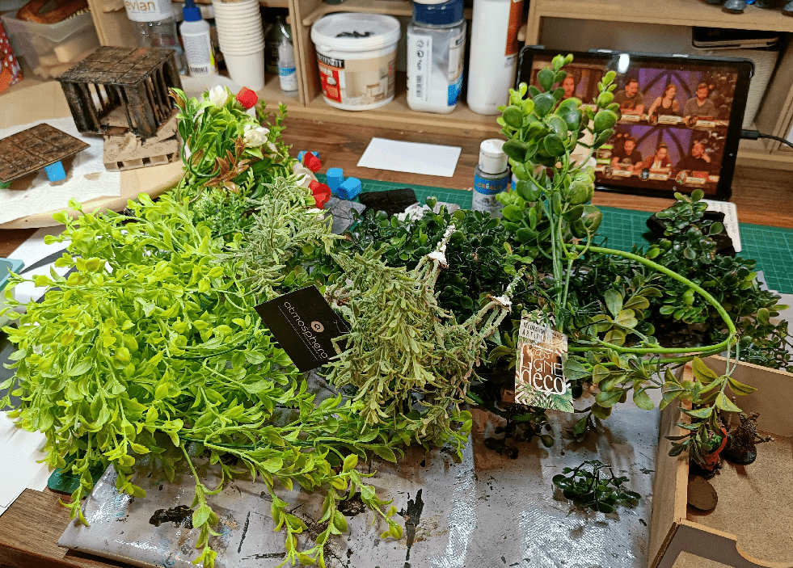

I initially bought a whole lot of plastic plants, thinking I would be able to use them to make hedges (spoiler: it didn't happen).

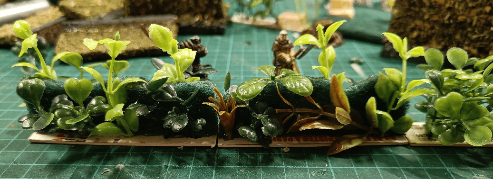

My first attempt was using a green sponge as a base, and glueing some offshots of plastic plants.

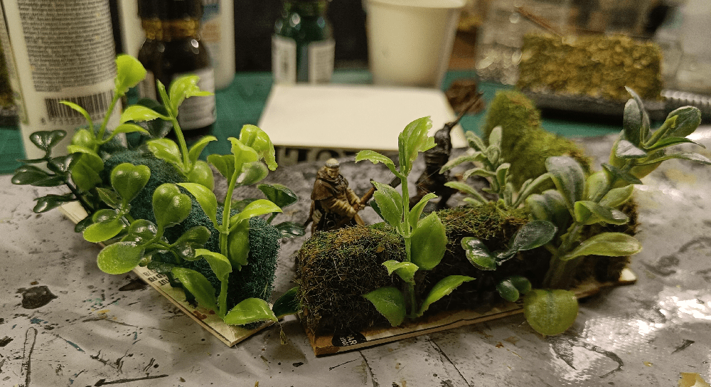

I added glue on the sponge, and dropped fine flocking on it. It kinda looked ok where the flocking landed, but it had two main issues. First, the plastic plants were out of proportion and looked like they were coming from a (bad) sci-fi movie. Secondly, the fine flocking make it look like the hedges were finely trimmed, which is definitely not going to happen in a Zombie-infested medieval town.

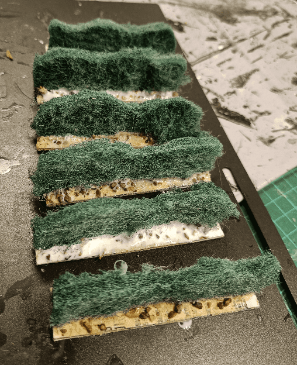

So I started, again, this time with the same green sponges, that I roughed it a bit with a knife, and cut in irregular shapes.

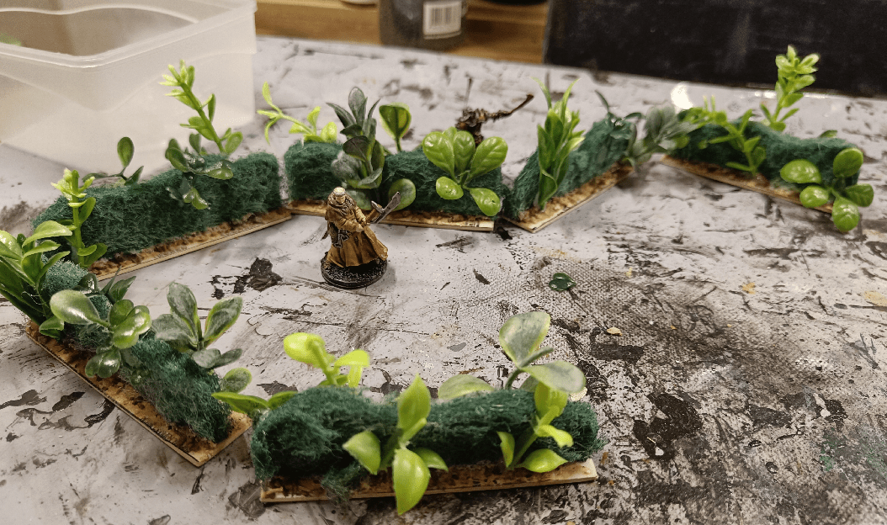

I added less plastic plants this time.

And covered everything with coarse flocking. Getting the flocking to stick was messy. I used a glue spray can, followed by the flocking, then some more glue. A whole mess.

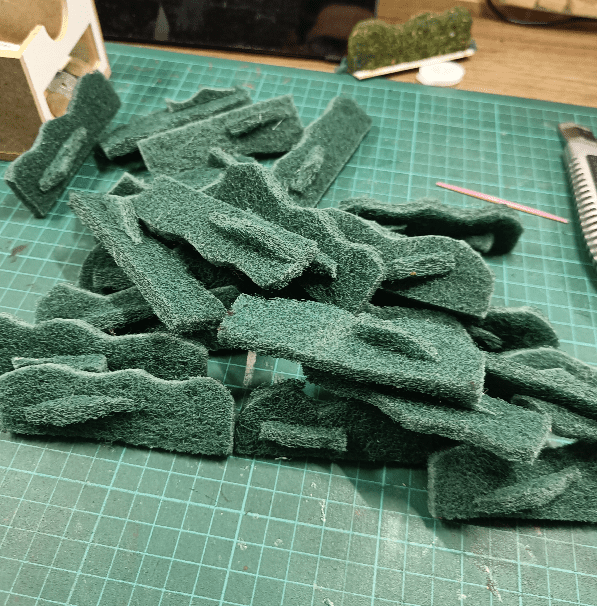

Third attempt, I made my life easier and decided to use less plastic plants, and re-used the waste of what I cut of to glue it back on the sides to give it some more width.

I added some small change coins at the bottom to add some weight so they won't easily topple.

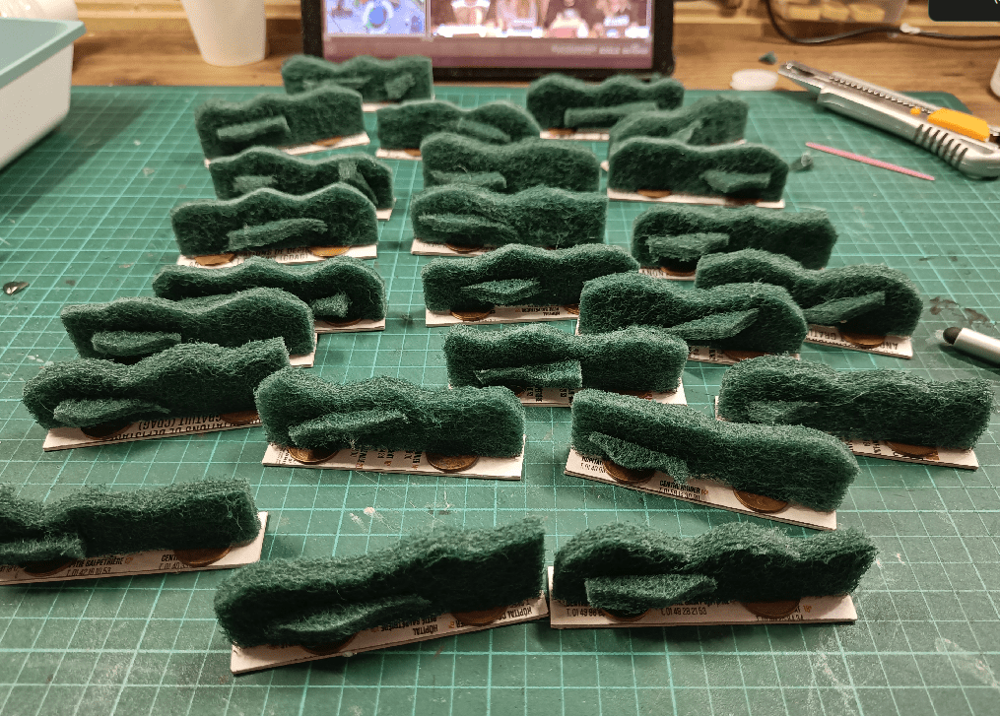

And made quite a few of them!

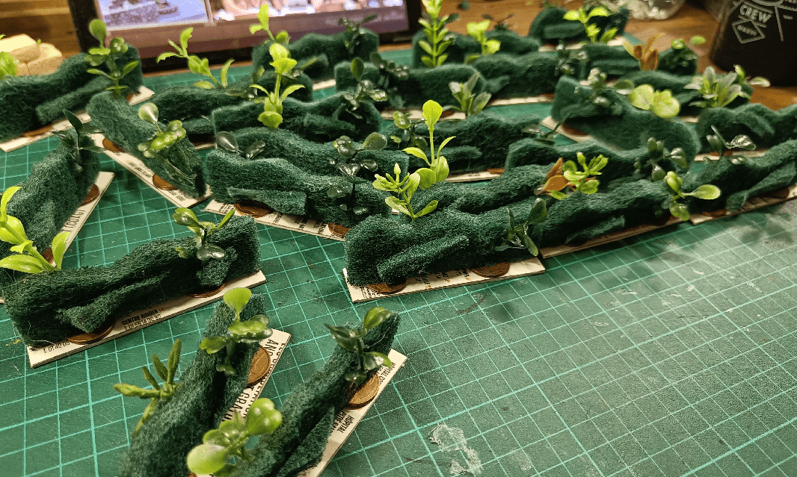

Only then did I add the small plastic plants. I limited to 2 per hedge.

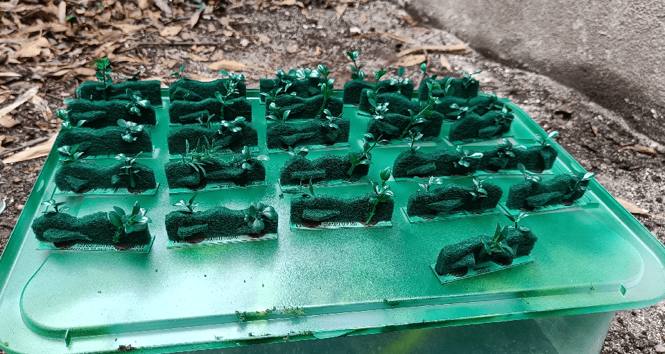

I basecoated everything with a layer of green paint. This would help not seing the neon bright plastic below in case my flocking doesn't stick.

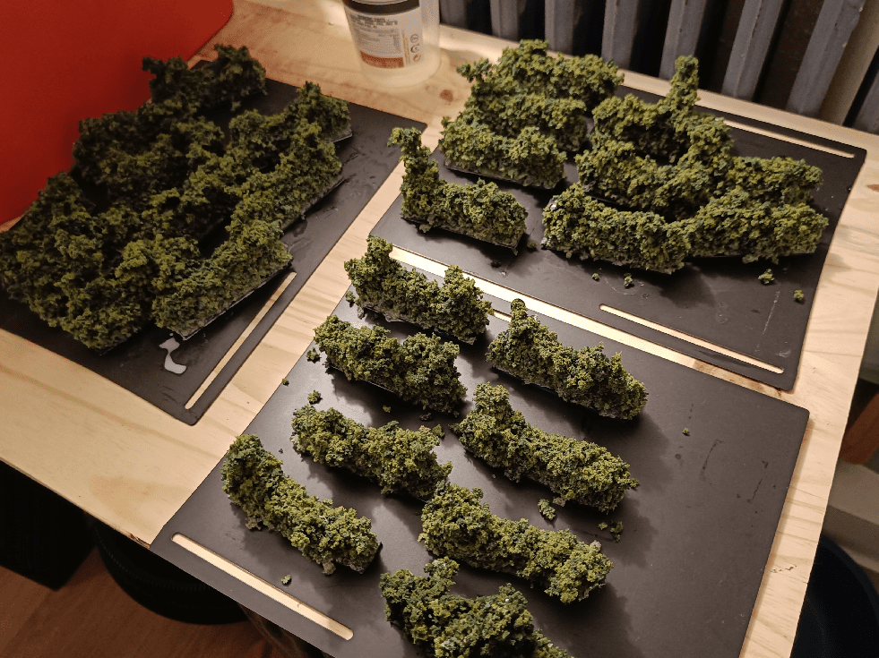

This time, I used a glue gun to put glue on the hedges, pressed the flocking on it, and kept going. As the glue cools pretty fast it means I had to do it 5-6 times per hedge, but in the end it stick pretty well.

I ended up also spraying a mix of Flow Improver and water on top of them, then some water+PVA glue. The Flow Improver + Water would really soak the tufts, so when I apply the diluted glue, it will really go inside every fiber. 

I then had to let it dry and the hedges are now very solid. I suggest you do that on a piece of silicone (or baking paper). I didn't, and all my hedges got glued to the black plastic sheets you see. Took me a while to rip them off without damaging them. (Glue doesn't stick to silicone).