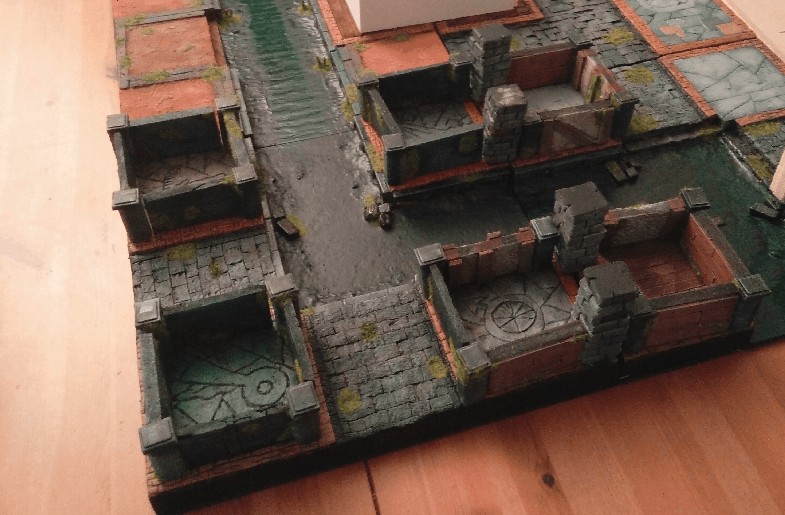
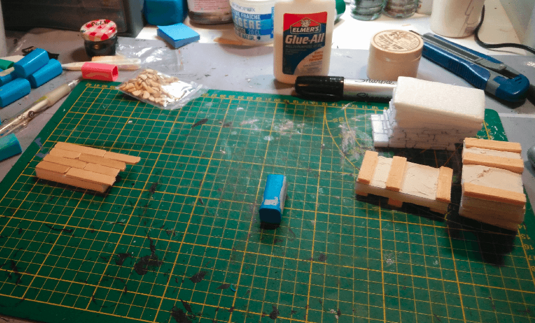
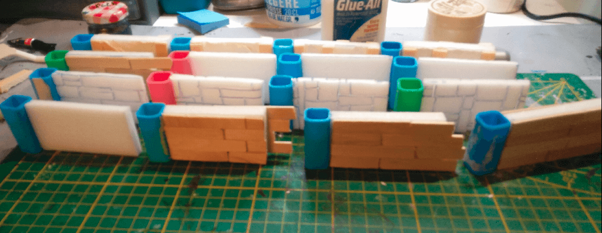
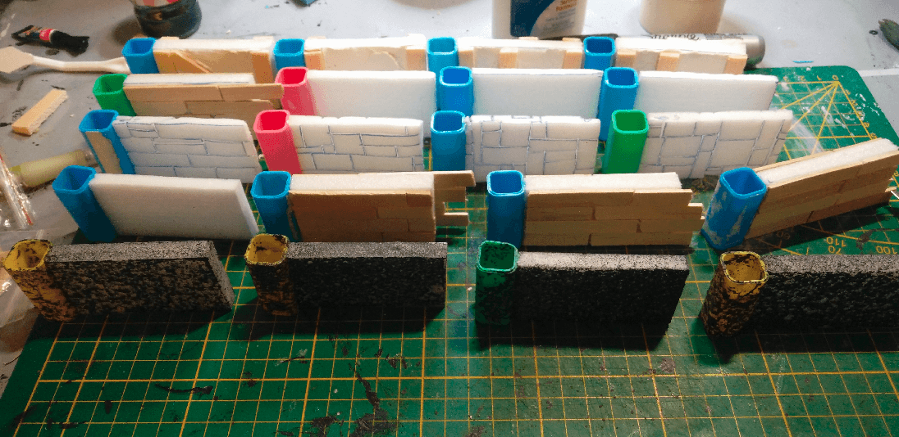
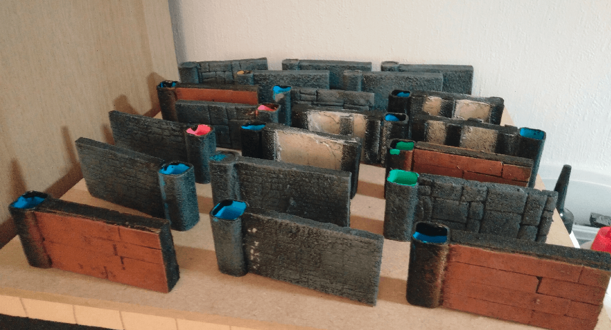
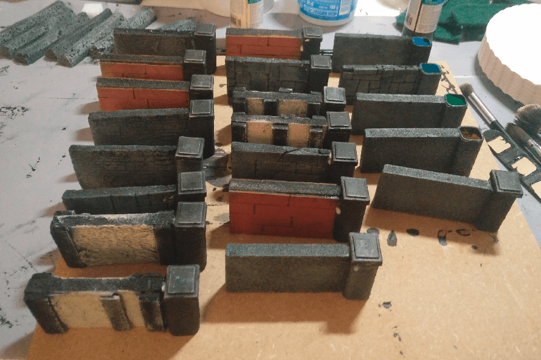
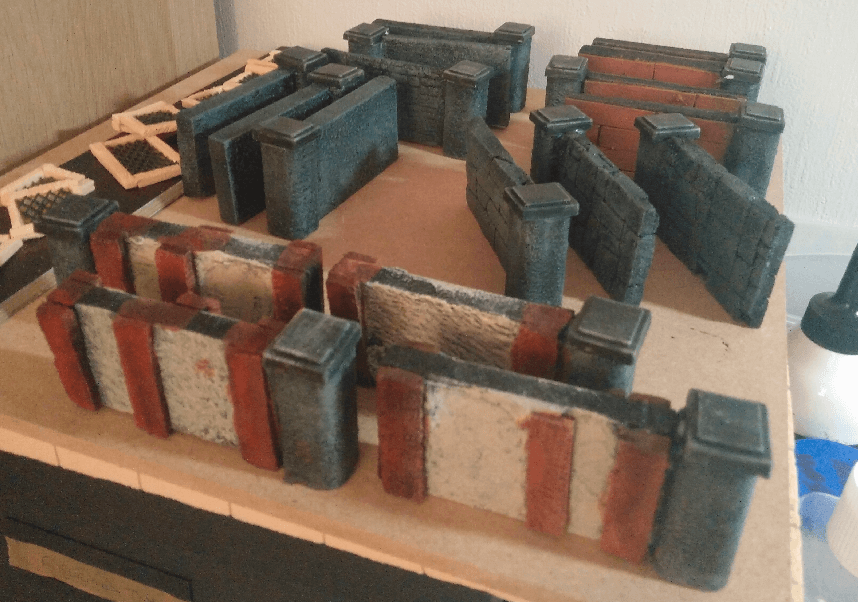
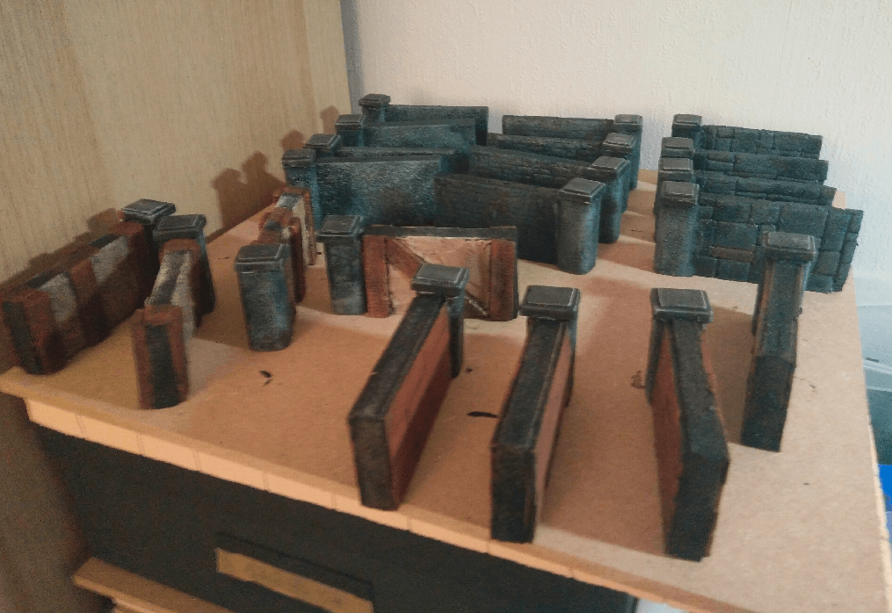
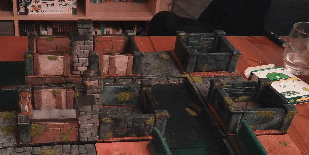
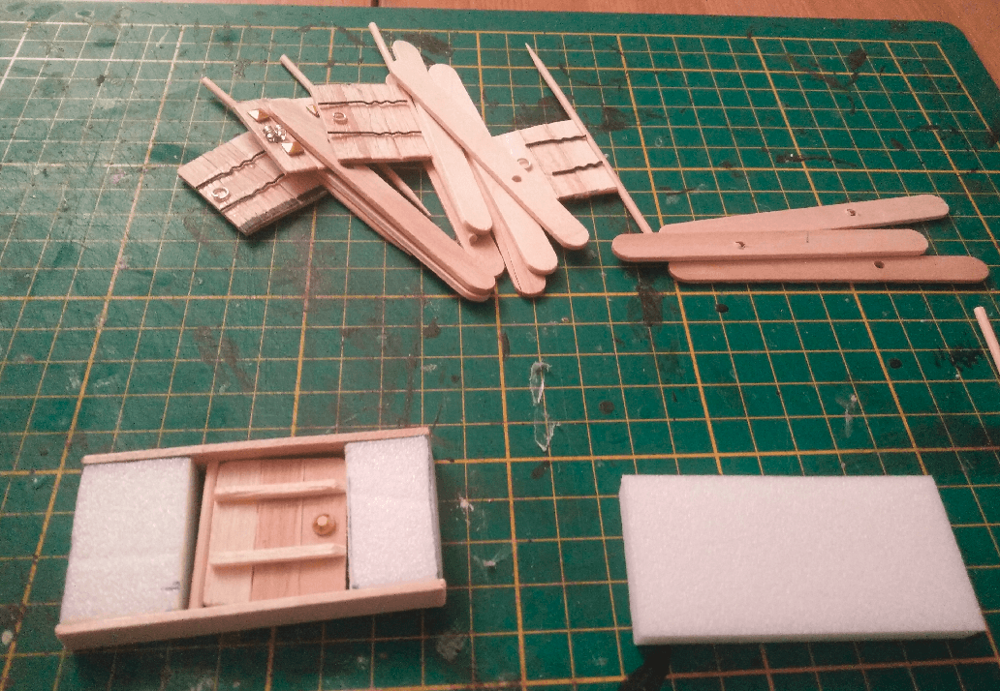

I needed my walls to be modular and stable. Modular so I could use them to represent streets in all the Zombicide configuration, and stable so they wouldn't fall on the table whenever we would bump into it.

I wasn't sure of the final design, so I decided to craft several different designs at the same time.

I started by cutting foam at the right dimension, and glued one of those medicine sticks at the end, to act both as a pillar, and to give some stability.

Some of them I covered in wooden planks. I didn't bother cutting at the exact right dimension. I glued the thing, and cut the excess afterwards.

Other were etched with a stone pattern, or embedded with a roller, and finally the last one had some filling paste added to look like a plastered wall.

Oh, and I also tried another row with a texture spray paint bottle. This is supposed to be used to give the look of raw stone to any wall, but I tried it on my miniature walls.

Here they are, in various state of painting. 

I topped the pillar with some plastic parts from an old board game and painted it black.

The painting is almost done, all the main colors are blocked, and the drybrush is set.

Now with a wash applied, it looks pretty nice. Overall I'm happy with how this project turned out.

I then added some flocking on it, and you can see how it looks on the Zombicide board. The dimensions are perfect for a houses that span only one tile. For the larger one I had to use pillars I crafted before to fill the gaps.

View from the other side. The overall look is great, but the playability not so much. They still are not _that_ stable, and more importantly, they're all individual pieces, they don't clip or stay together.

If I were to redo another batch, I would try to find a way to have them stick together, maybe with magnets, so I could create the shapes, and have them stay in place.

I also tried to make some with (working) doors. Zombicide has a rule mechanism around doors, and it is important to materialize where doors are, and if they are opened or closed.

I kept the same design as a the normal wall, but added an ice cream handle on top and bottom, drilled a small all in it, and used toothpicks or barbecue skewers for the door hinges.

I lost a lot of pictures from the crafting of those doors, because I went through 2 different designs and crafted around 15 total. They look good (enough), but suffer the same issues as the regular walls: not stable enough on the game table.