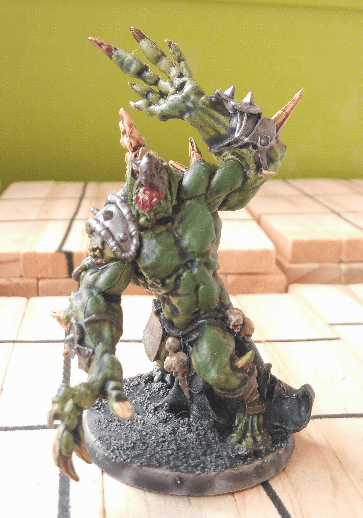

I was really uninspired by this mini for a long time and it sat on my table unpainted for months. Then I decided to try my new Citadel Contrast paints on it. It finally turned out better than I expected.

I used the green contrast on the white priming directly, used a brown contrast on the leather and then painting the metal in my usual way. The overall visual aspect is much better than what I would have achieved otherwise. Contrast paint are a great way to get it over with miniatures that don't inspire you.