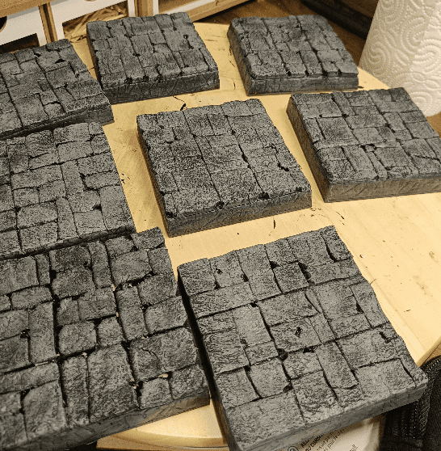
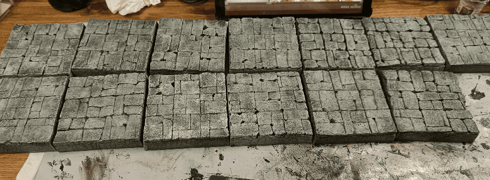
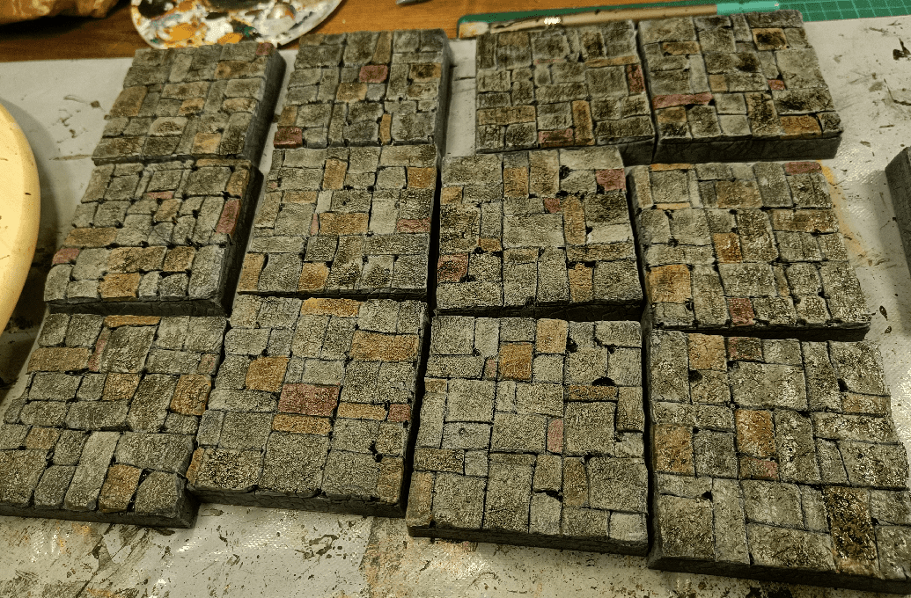
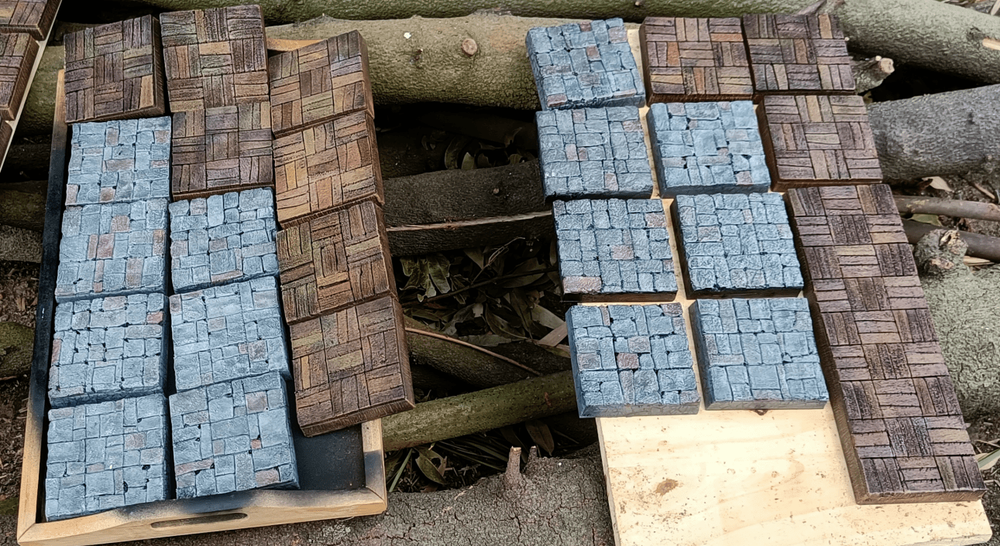

Next up would be the road tiles. For those, I went with a stone pattern that still let see the 3x3 matrix inside. I thought that even outside of Zombicide, I could use those tiles in other tabletop games.

I started with the same layer of foam glued on existing wooded squares, and cut to size. I traced the initial 3x3 matrix (each square is itself 3cm per side).

I then carved each square in stones. The full process isn't shown here but what I do is split each square in two alternatively horizontally and vertically. I do not put the separation in the middle, but always slightly off.

Then, for each square split like this, I split again randomly one of the sides. Sometimes I split both sides. Sometimes I split one side twice.

Then it's a matter of carving a thin line with an exacto knife, making it bigger with a pen, and rounded the corners by going along the curvature. It takes times, but is easy to do, so you can definitely do it while doing something else (I watch Critical Role myself while doing it).

Cover in black.

First gray overbrush.

Drybrush of a lighter gray.

Adding various grays and browns in what I call the "Chocolate Phase".

Darken everything with a black wash.

And drybrush everything one last time with light tan, to unify it together.

And here they are, drying after the varnish, along with the wooden tiles.

