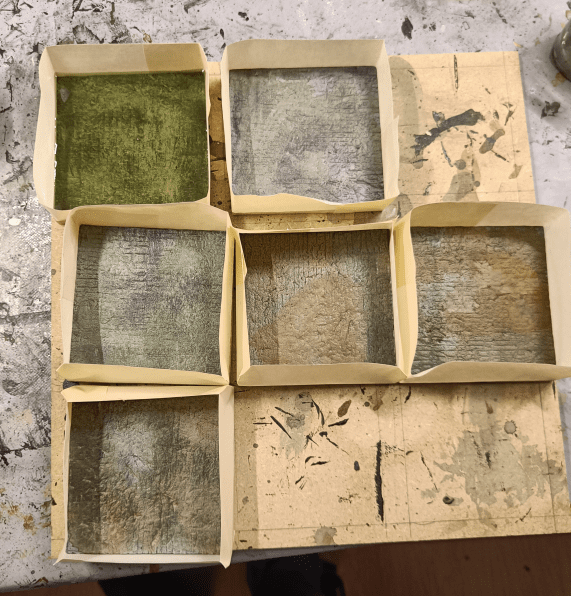

I kept going on the Zombicide Tiles, this time with the Sewer ones. In Zombicide: Green Horde, some tiles are covered with sewage. Movement is slower, and they are supposed to be lower in the ground than other tiles.

I used a fine layer of foam on top of my coaster. I then applied texture with a texture roller. As the foam was very thin, the roller manager to correctly imprint its texture.

I drybrushed some gray.

And added some colored ink on top, to give them some grit. I picked various beige, gray, brown and green and used two random colors on each tiles, for variety.

I then covered the edges with masking tape, and started pouring some silicone into them. I slightly tinted the silicone with green ink.

This came out great, but the edges were all slightly curved, so I had to level them back.

For an added layer of grimness, I added two drops of my original inks in top, and mixed them.

