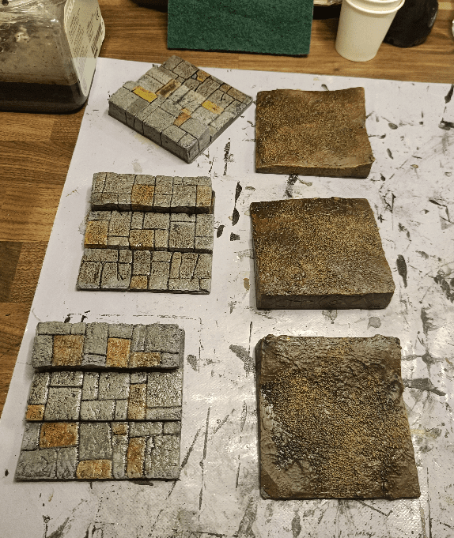
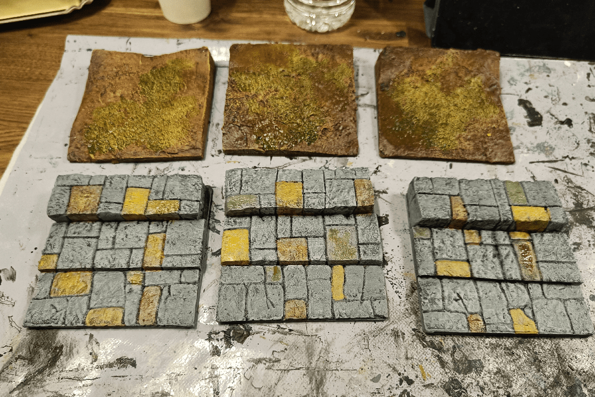

The final type of tiles to do were "Stairs" (or Legde) Tiles, to get out of Sewer Tiles without incurring movement penalties. As one can get out to street level or dirt level, I had to make two different types of them.

The brown ones are simply made by rougly cutting diagonally a piece of foam, then adding spackle to smoothen it out and some sand for texture. The Stairs one are made by cutting the foam at two different stages and texturing it with the usual brick pattern.
