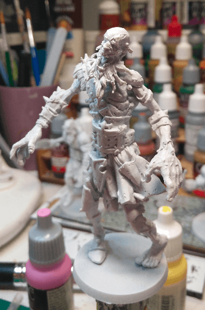
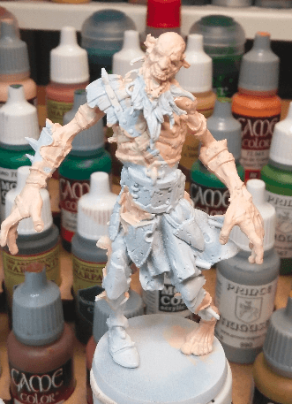

I recently had discovered the GW Android Application, and it was suggesting a set of steps to paint a zombie flesh tone. I decided that it was the right opportunity to try to paint my Giant Zombie, as it was giving me a lot of flesh space to experiment.

First basecoat of Pale Flesh. I wonder if I will paint all the flesh first, as suggested by the GW App, and the paint the other parts, or if I'll just block all my basecoats first. I've always basecoated everything first, I find it helps me better see what the miniature will look like. But maybe I should try something different?