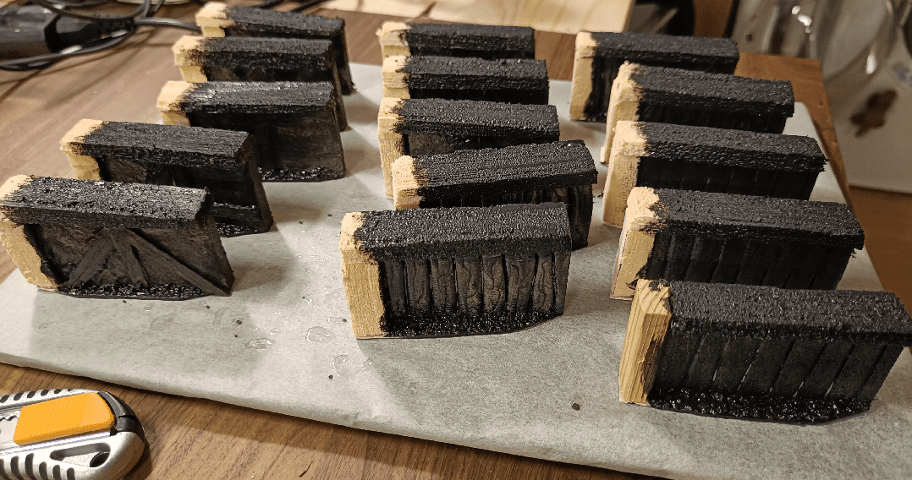
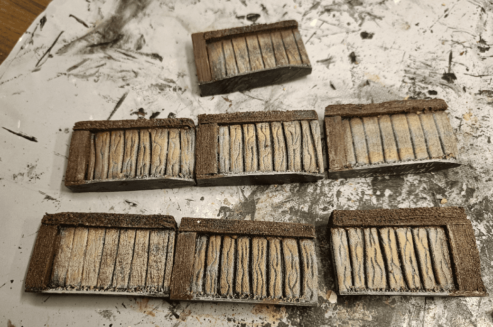
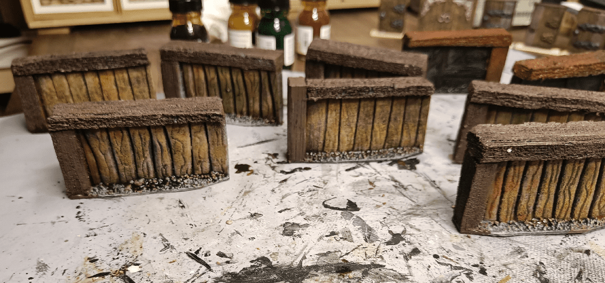
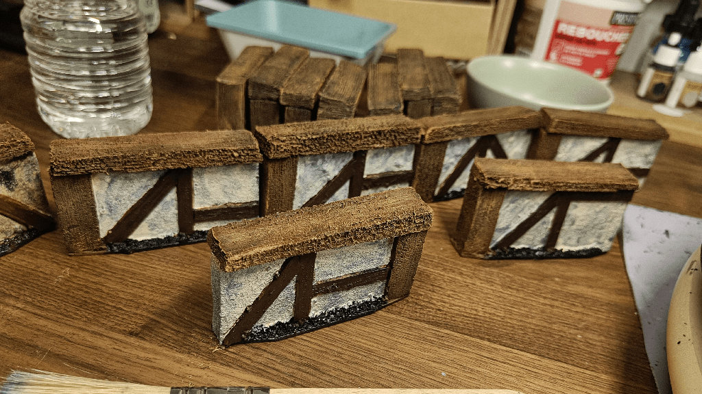

I had already made some walls for Zombicide in a previous post, but I didn't have enough to correctly fill all scenarios. So I decided to make more.

First time I had been using some old pharmaceutical tubes for the corner pillar. This time I was out of those, so I used foam instead. I textured it like wood using a wire brush, and glued it all to a piece of cardboard.

I cut the angles of the cardboard base to help in arranging them in angles. I also used a thinner type of foam for the wall itself.

I decided to make two types of walls. One with the visible planks of classical wattle and daub (torchis in french) walls, and another type as classical wooden planks.

I used ice cream sticks for the first type, and added some wood texture using a knife (some large slashes).

I also added some coarse wood texture using a ballpen on the other type.

To texture the walls, I didn't want to get into the trouble of using spackle on such small surfaces. It would have been too messy. Instead, I put white glue on the walls, with a bit of water, just so it could flow into every corner. Then I sprinkled baking soda on top of it.

It gave a nice, uneven, texture to it, and stayed in the right areas.

I did that on both sides, and would definitely do that trick again in the future.

Some of it leaked on top the wood, but that's ok. I could have gone further and scratch it a little bit here and there while it was still drying, to simulate cracked texture, but hey... I didn't think of it in the moment.

I added pebbles on the base to add some weight (those things are only made of foam, so they need some weight). I added a layer of black mod podge (in two steps, as you can see, I still needed to not paint the column as I needed a way to hold them).

Also, I ran out of foam pillars, so had to use a wooden bit for one of them.

I went for a nice wood for the wattle and daub ones, but I tried to make it all old and moldy for the other ones, so I started with an undercoat of grey.

I then drybrushed some brown on it, but it didn't really make it the effect I had in mind.

Not too bad, but not exactly what I was aiming for either.

Here are the other ones. Aren't they pretty?

Some brown wash on top of it, and letting it pool on the sides for this old dirty look.

