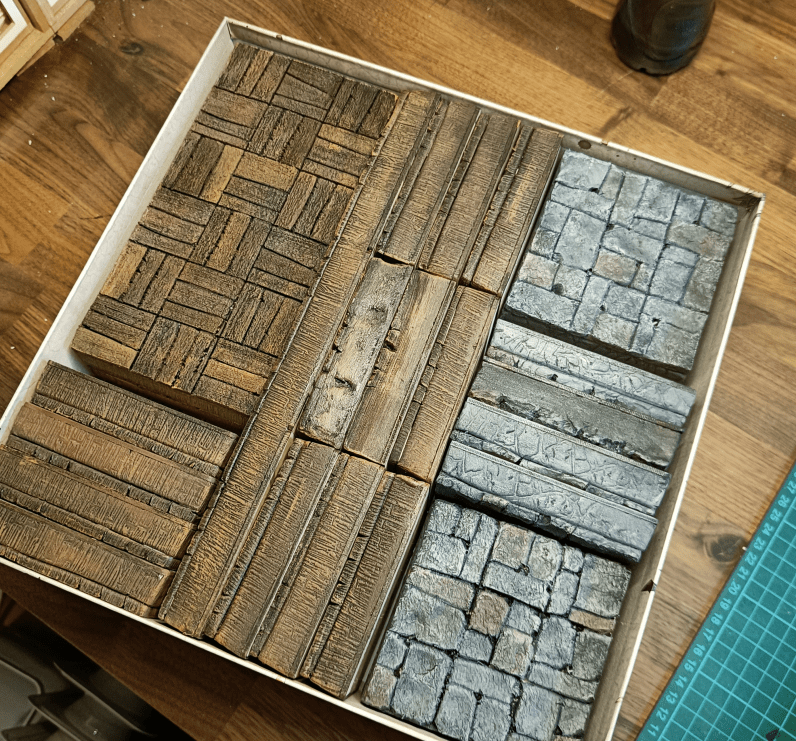
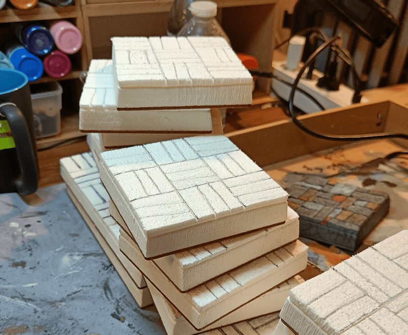
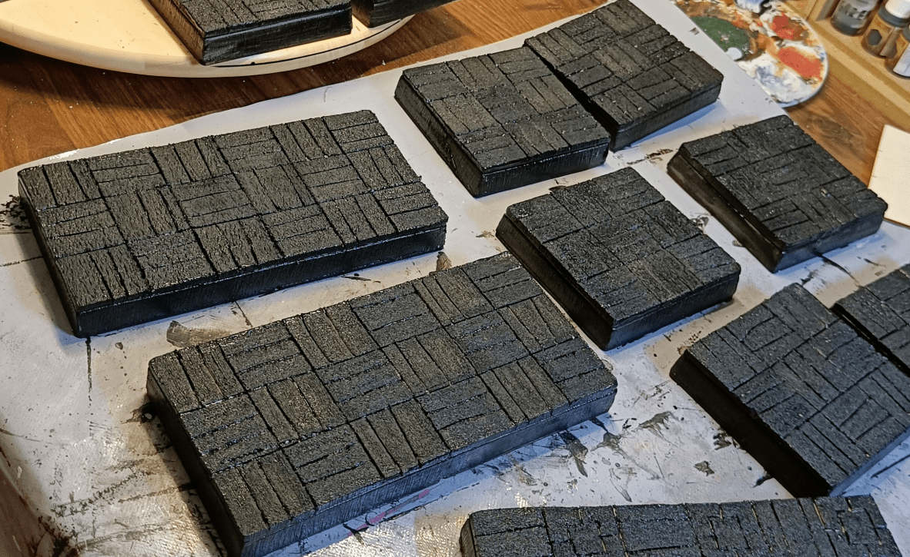
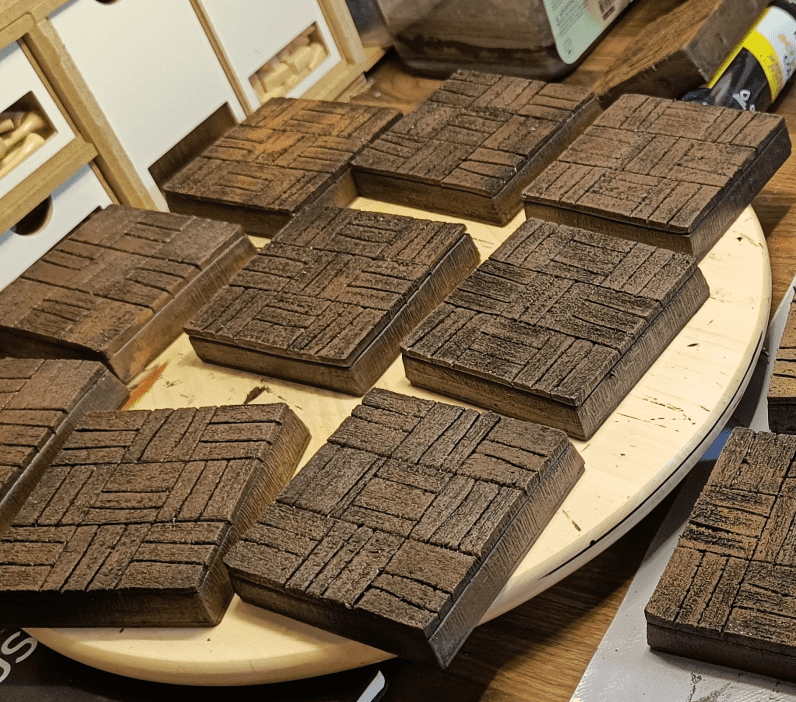
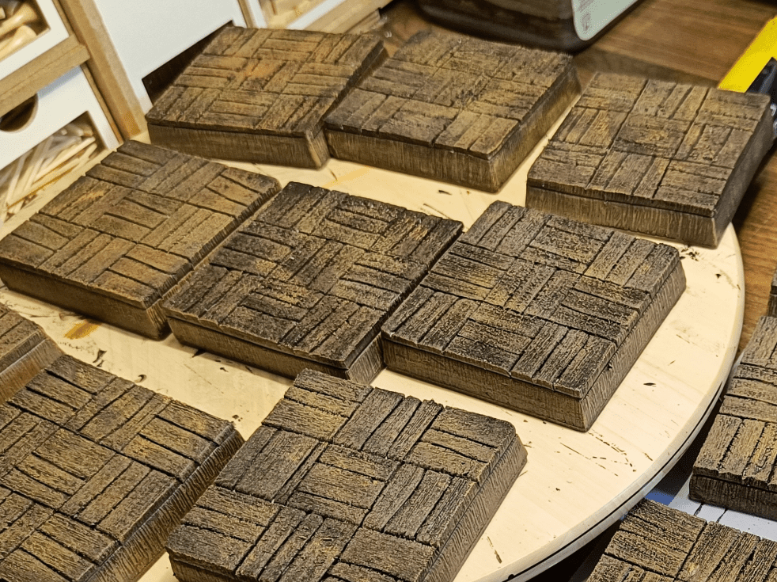
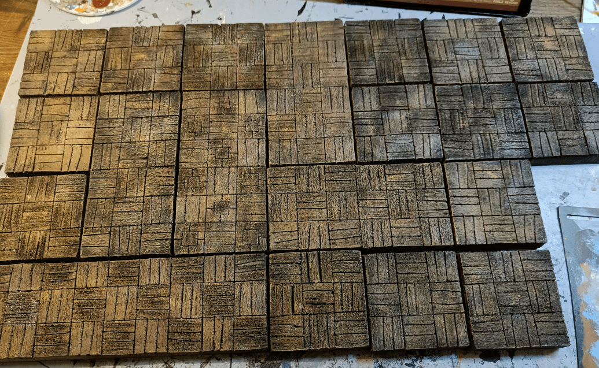
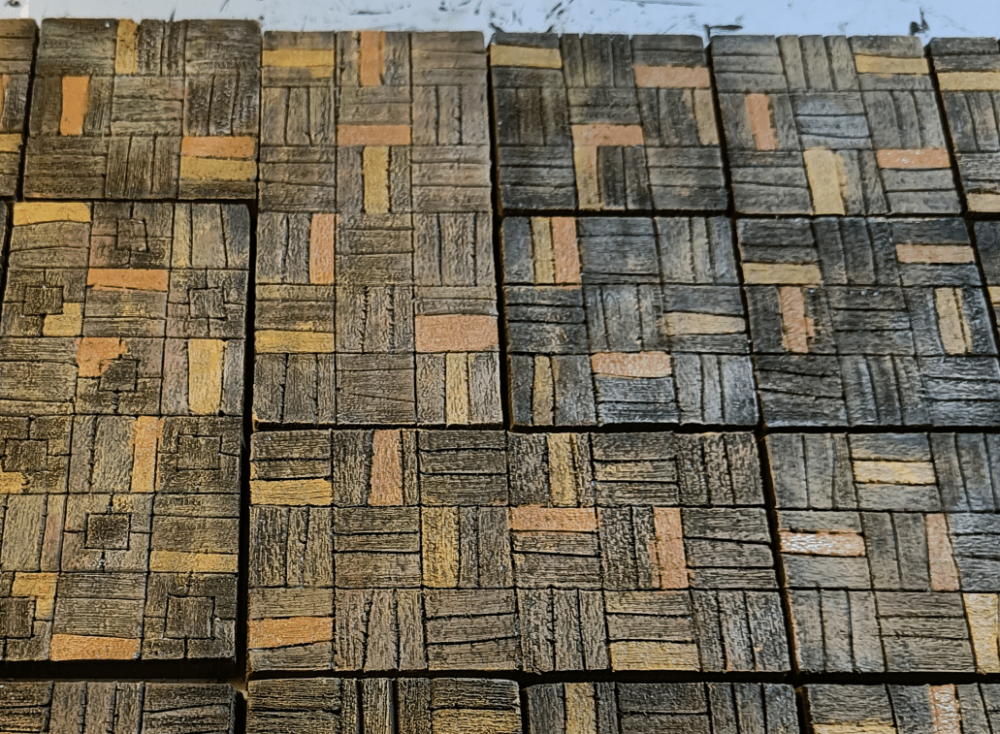
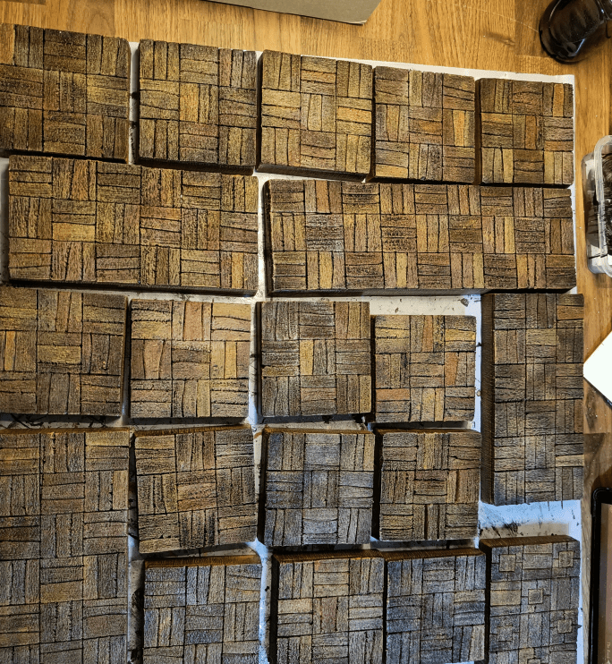

After my stone and earth tiles, I also needed to work on the wooden tiles. As you can see in the picture, I made some simple and some double tiles, to represent the two sizes of rooms available in Zombicide.

Those wooden tiles are meant to represent the inside of houses. I know that in the official tiles of Zombicide, not all houses have wooden floor, but with the 3D representation I'm going with, it makes distinguishing the difference between inside and outside easier to have all insides wooden.

Similar to the stone tiles, I start with the basic pattern. Each square is made of three wooden slats, and I alternate the orientation so all squares are perpendicular to each other. I also add a line on the side, to give the 3D illusion of a floor.

Before applying the black layer, I did brush every single slat with a steel brush, to simulate the imprint of wood grain.

Initial overbrush of brown.

First drybrush of light brown. I didn't apply it everywhere, instead I did some circular motions here and there to give it a random look.

I did use different kind of browns, at an attempt at simulating different kind of wood. I wouldn't be able to replicate it if I wanted, but I like the variety it gave me.

Same as the stone tiles, I did paint randomly some slats in a different color. Once again, it's a way to add visual variety and the the final result doesn't look like one big brown area.

And here is what it looks like once finished.

